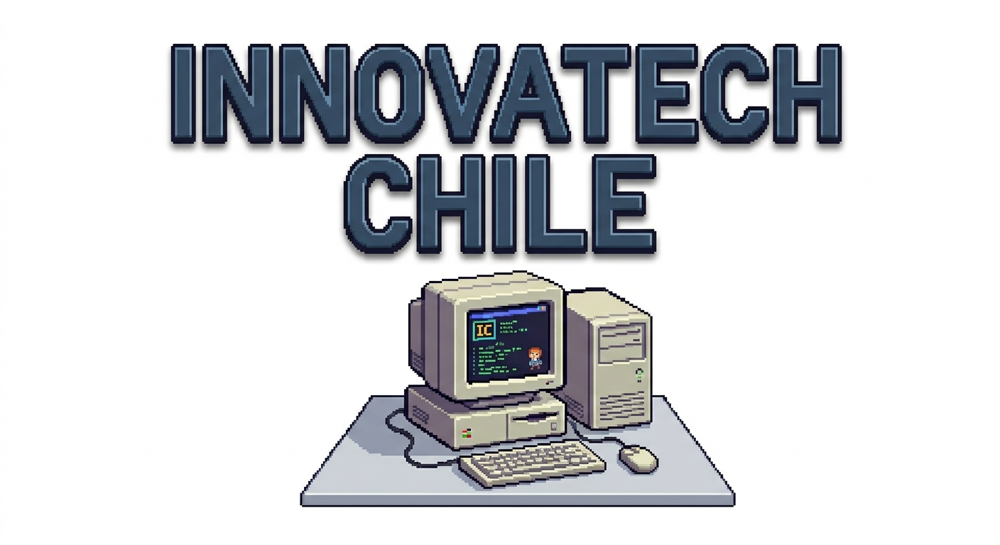
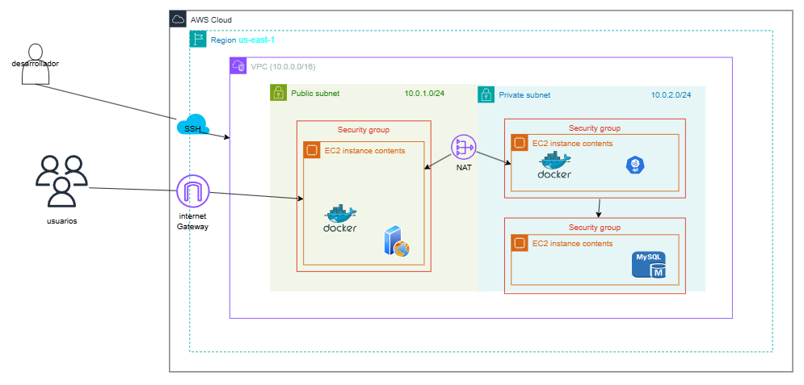

 

# Proyecto AWS Lift & Shift - Innovatech Chile

## Descripción

Infraestructura gestionada con Terraform para desplegar una arquitectura de tres capas en AWS bajo el enfoque Lift & Shift, para la migración de la infraestructura on-premise de Innovatech Chile.

• Una VPC (10.0.0.0/16) con subred pública y subred privada.

• Tres instancias EC2: Frontend (pública), Backend (privada) y Data (privada).

• NAT Gateway para tráfico saliente de las capas privadas.

• Internet Gateway para acceso público al Frontend.

• Security Groups por capa bajo el principio de mínimo privilegio.

• Automatización de instancias mediante Launch Template y User Data.

• Infraestructura reproducible con Terraform.

# Diagrama
 

# Estructura del proyecto

Innovatech-develop/
├── backend/
│   ├── src/main/java/cl/innovatech/backend/
│   │   ├── BackendApplication.java
│   │   ├── controller/PlanController.java
│   │   ├── model/Plan.java
│   │   └── repository/PlanRepository.java
│   └── resources/application.properties
│   └── pom.xml
├── frontend/
│   ├── src/App.jsx
│   ├── src/main.jsx
│   ├── index.html
│   ├── vite.config.js
│   └── package.json
├── infra/
│   ├── main.tf
│   ├── instances.tf
│   ├── security_groups.tf
│   └── provider.tf
├── .github/workflows/ci.yml
└── README.md

# Requisitos 
•Terraform CLI versión >= 1.0

•AWS CLI configurado con credenciales válidas (AWS Academy / Educate)

•Par de claves EC2 llamado innovatech-key creado en la región us-east-1

•Permisos de administrador o políticas IAM para EC2, VPC, NAT Gateway

•Node.js >= 20 (para desarrollo frontend local)

•Java 21+ y Maven (para desarrollo backend local)

# Flujo de uso

1. Clona el repositorio:

    git clone <url-repositorio>
    cd Innovatech-develop/infra

2. Iniciar Terraform: 

    terraform init

3. Verificar Plan:

    terraform plan

4. Aplica la infraestructura: 

    terraform apply

# ¿Qué despliega este proyecto?

Red (infra/main.tf)

•VPC innovatech-vpc con bloque CIDR 10.0.0.0/16, DNS habilitado.

•Subred pública 10.0.1.0/24 en us-east-1a (con IP pública automática).

•Subred privada 10.0.2.0/24 en us-east-1a.

•Internet Gateway innovatech-igw conectado a la VPC.

•NAT Gateway con IP elástica (EIP) en la subred pública.

•Route Tables separadas para tráfico público (IGW) y privado (NAT).

# Arquitectura de tres capas

Internet
    │
    ▼
[Internet Gateway]
    │
    ▼ Puerto 80/443
┌─────────────────────────────────────────────┐
│           Subred Pública 10.0.1.0/24        │
│                                             │
│   EC2 Frontend (Nginx + Docker)             │
│   Expuesto a Internet                       │
└───────────────────┬─────────────────────────┘
                    │ Puerto 8080 (HTTP)
                    ▼
┌─────────────────────────────────────────────┐
│           Subred Privada 10.0.2.0/24        │
│                                             │
│   EC2 Backend (Spring Boot + Docker)        │
│   Solo accesible desde Frontend             │
│                   │                         │
│                   │ Puerto 3306 (MySQL)     │
│                   ▼                         │
│   EC2 Data (MySQL vía Docker)               │
│   Solo accesible desde Backend              │
└─────────────────────────────────────────────┘
                    │
                    ▼ (tráfico saliente)
             [NAT Gateway]
                    │
                    ▼
             [Internet]

#  Seguridad y control de acceso

• Frontend (público): accesible desde Internet por puertos 80/443.

• Backend (privado): solo accesible desde el Frontend (puerto 8080).

• Base de datos (privada): solo accesible desde el Backend (puerto 3306).

• Las capas privadas no tienen acceso directo a Internet; usan un NAT Gateway.

• Acceso administrativo mediante:

      SSH (clave innovatech-key)
      AWS Session Manager
