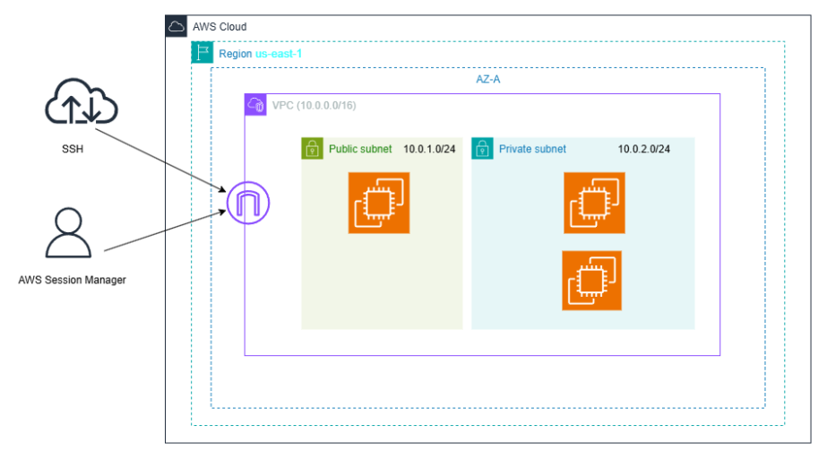

 

# Proyecto AWS Lift & Shift - Innovatech Chile

## Descripción

El proyecto consiste en el diseño y implementación de una arquitectura en la nube utilizando aws, bajo el enfoque Lift & Shift.

## Arquitectura

Se utilizó una arquitectura de 3 capas:

- Frontend: capa pública donde se encuentra el servidor web

- Backend: Capa privada donde se procesa la lógica

- Data: capa privada donde está la base de datos

## Componentes utilizados

- VPC (10.0.0.0/16)
- Subred pública y privada
- Internet Gateway
- NAT Gateway
- Instancias EC2:
  - Frontend
  - Backend
  - Base de datos
- Security Groups
- Terraform

## Seguridad

Se aplicaron medidas básicas de seguridad:

- Solo el frontend está expuesto a internet  

- El backend solo recibe tráfico desde el frontend  

- La base de datos solo recibe tráfico desde el backend 

- Se utilizaron Security Groups para controlar el acceso

## Flujo del sistema

Usuario → Frontend → Backend → Base de datos  

Este flujo permite separar las funciones de cada parte del sistema.

## Automatización

Se utilizó Terraform para crear la infraestructura automáticamente.

....falta